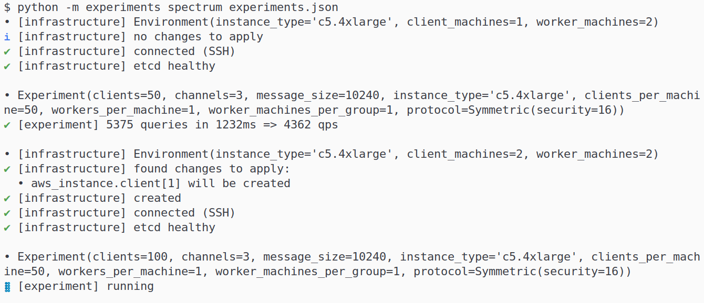

# spectrum-impl

[](https://travis-ci.com/znewman01/spectrum-impl)

Implementation and experiments for the [Spectrum paper].

**Disclaimer:** research code, not for production use.

[Spectrum paper]: https://github.com/sachaservan/spectrum-paper


## Project Structure

Our Spectrum implementation is written primarily in Rust. This project is a
[Cargo workspace] containing 3 crates; run tests for all three with `cargo test`.
(We use some pretty new features, so you may need a recent nightly of Rust; see
the "Experiments" section).

For details, see the (slightly outdated) [design document].

[design document]: (https://docs.google.com/document/d/1Z8g1ovBGFthpsDLR_88Pn4-9tKX_QnbV0ZSba2UwXno/edit#).

### `spectrum_primitives`

This crate contains interfaces and constructions for primitives used in
Spectrum. Highlights:

- We start with low-level algebraic primitives (`Group`, `Field`). We include
  both toy constructions (`IntsMod<p>`, which is generic over the modulus; use
  `IntMod<7>` or so for debugging) and the values we ultimately use (a
  prime-order subgroup of the [Jubjub] elliptic curve and its associated scalar
  field).
- We then build a pseudorandom generator (`Prg`), including a [seed-homomorphic]
  variant.
- We build [distributed point functions] (`Dpf`) and an extension: *verifiable*
  distributed point functions (`Vdpf`), which have additional methods for
  creating and auditing proofs.
- Miscellaneous utilities include a `Sampleable` trait for taking samples of
  these objects (à la [`rand::distributions::Distribution`]) and a trait for
  secret-shareable (`Shareable`) values.

For each of these, we provide an interface and an associated test suite to
verify correctness properties (using [property-based testing]). For instance, we
check associativity for a `Group` `G` (clones omitted):

``` rust
#[test]
fn test_associative(a: G, b: G, c: G) {
    prop_assert_eq!((a + b) + c, a + (b + c));
}
```

The test runner ([`proptest`]) then checks this for random `G` instances; if an
error is found, a minimal case is reported (e.g., the smallest `G` that triggers
the error). We do *not* check security.

This contains (very rudimentary) benchmarks too.

[Jubjub]: https://github.com/zkcrypto/jubjub
[seed-homorphic]: https://crypto.stanford.edu/~dabo/pubs/papers/homprf.pdf
[distributed point functions]: https://www.iacr.org/archive/eurocrypt2014/84410245/84410245.pdf
[`rand::distributions::Distribution`]: https://docs.rs/rand/0.8.3/rand/distributions/trait.Distribution.html
[property-based testing]: https://hypothesis.works/articles/what-is-property-based-testing/
[`proptest`]: https://github.com/AltSysrq/proptest

### `spectrum_protocol`

This crate contains the interface and constructions for the Spectrum *protocol*
(`Protocol`, unimaginatively). As above, we provide correctness tests. The
constructions are a thin wrapper around the primitives in the above crate;
they're generic over the choice of `Vdpf`.

This crate also introduces [protocol buffer] definitions for the protocol

[Cargo workspace]: https://doc.rust-lang.org/book/ch14-03-cargo-workspaces.html
[protocol buffer]: https://developers.google.com/protocol-buffers/

### `spectrum`

This contains the practical implementation: client/server binaries, data
structures, multithreading, service discovery/coordination, etc. It's built on
[`tonic`], a [gRPC] implementation.

[`tonic`]: https://github.com/hyperium/tonic
[gRPC]: https://grpc.io/

### `experiments`

This is a Python module which runs experiments on Spectrum and other systems.
The top-level directory is system-agnostic (though opinionated about workflow).
To add more systems, add a new subdirectory (`express` contains a nice, mostly
minimal example). See "Experiments" section for usage.

### `data`

This contains the parameters for generating the set of experiments we run
(`make_experiments.py`). Contains some helper scripts for collecting
miscellanous data (dates, Rust version, instance costs, LoC count) and running
several experiments sequentially (`run_experiments.sh`) and comparing performance
across commits (`benchmark_diff.sh`).

Good news: assuming local dependencies are installed and configured correctly,
this (`run_experiments.sh`) is sufficient to collect all the data in the paper.
Bad news: this is the least likely parts to work on anybody else's machine
(hardcoded paths, references to OS-local files); sorry! They should be
sufficient to piece together something that works for you.

## Installation

Development was done on NixOS, and a `shell.nix` file contains a complete record
of dependencies (though not exact versions) for easy installation (`nix shell shell.nix`).

[NixOS]: http://nixos.org/

### Local Development

For local development, the main dependencies are:

- Rust (likely a recent nightly needed)
- Build dependencies: `m4`, `proto`
- Libraries including (but not limited to): `libgmp6`, `libffi`, `openssl`, `glibc`

Optional dependencies include:

- `etcd`, for local testing involving service discovery
- `gnuplot`, for visualizing local benchmarks

### Experiments

We require:

- [Packer], for building machine images
- [Terraform], for managing cloud deployments
- Python (3.8), for running the experiment scripts
- Python dependencies (in `experiments/requirements.txt`; [venv] advised)

For the final numbers (including metadata, code count, etc.) we require:

- cURL: for pulling data from a couple of places
- AWS CLI (v2): for instance type data (cores, RAM, etc.)
- [Tokei]: for lines-of-code count

[Terraform]: https://www.terraform.io/
[Packer]: https://www.packer.io/
[venv]: https://docs.python.org/3/library/venv.html
[tokei]: https://github.com/XAMPPRocky/tokei


## Usage: Spectrum binaries

Throughout, use `--help` to see parameters.

We provide `client`, `viewer`, `worker`, `leader`, `publisher`, and `setup`
binaries, roughly as described in the [design document]. These are relatively
complicated to use together, so we recommend using the experiment scripts for
evaluation and below methods for local testing.

For local development, the primary entry point is `cargo run --bin run_inmem`,
which will run all of the parties in the protocol in-memory.

We can run some quick local tests of the *whole* system (including local
TCP connections) with `cargo run --bin run_processes`. This requires some setup:

- It will take care of running `etcd` for you, but you need an `etcd` binary on
  your `$PATH`.
- Set `$SPECTRUM_BIN_DIR` to point to a directory containing compiled Spectrum
  binaries.

Make sure to use `--release`, and maybe set `ulimit -n 8192` if you're
attempting to run larger scale tests. We also provide an entry point for more
structured local testing. By default, this runs some hard-coded parameters, but
we accept arbitrary inputs in CSV format:

```
$ cat input.csv
2,1,50,8,,1250000
2,1,50,8,63,1250000
$ cargo run \
      --release \
      --bin local_experiments \
      -- \
      --output data.csv \
      --input input.csv
Running: InputRecord { groups: 2, group_size: 1, clients: 50, channels: 8, security_bits: None, msg_size: 1250000 }...done. elapsed time 293.903964ms
Running: InputRecord { groups: 2, group_size: 1, clients: 50, channels: 8, security_bits: Some(63), msg_size: 1250000 }...done. elapsed time 600.449376ms
$ cat data.csv
groups,group_size,clients,channels,security_bits,msg_size,elapsed_millis
2,1,50,8,,1250000,293
2,1,50,8,60,1250000,600
```

This mode works interactively, too (`--input -`), though for one-off executions
`run_inmem` is probably be better.

[`etcd`]: https://etcd.io/

## Experiments

We've tried to make our measurements (including measurements of other systems)
as reproducible as possible, but none of this has been tested except on the
authors' machines; small tweaks may be needed.

To that end, our cloud-based experiments can be run with the provided scripts.

### Running 

First, you need the usual [AWS credentials] and all dependencies installed.

Then, with the following in a file called `experiments.json`:

``` json
[
{"workers_per_machine": 1, "channels": 3, "clients": 200, "message_size": 10240},
{"workers_per_machine": 1, "channels": 3, "clients": 200, "message_size": 10240}
]
```

Run `python experiments spectrum --build release`.

Parameters are explained in the script help for each system. If all goes well,
you should see something like (transcription in this document below if images are unsuitable):



The script batches the inputs that have the same "environment" (need the same
cloud resources) for better performance.

For debugging, we provide simple SSH scripts for each system that allows SSH
easy in to Terraform-deployed VMs. For instance, run

``` bash
python -m experiments.spectrum.ssh --worker 1
```

to SSH into worker machine 1. Use `--help` to see available options.

**By default, the experiment script leaves resources running!** This allows for
running batches more efficiently. Use the `--cleanup` flag to tear down on
completion, or run:

``` bash
echo [] | python -m experiments --cleanup spectrum -
```

[AWS credentials]: https://docs.aws.amazon.com/sdk-for-php/v3/developer-guide/guide_credentials_environment.html

### Under the hood

We provide [Terraform] templates for deployment, and [Packer] configurations for
machine images. The Python script does the following:

- Builds a machine image using Packer, if needed (e.g., if sources have
  changed). Use the `--force-rebuild` flag to invalidate this cache (in a file
  on disk).
- Use Terraform, passing in the machine image and environment parameters (number of
  machines, machine type), to set up infrastructure.
- SSH into these machines to run the experiments, parsing the output to get
  performance numbers.

### Transcription of experiment script output
```
$ python -m experiments spectrum experiments.json
• [infrastructure] Environment(instance_type='c5.4xlarge', client_machines=1, worker_machines=2)
ℹ [infrastructure] no changes to apply
✔ [infrastructure] connected (SSH)
✔ [infrastructure] etcd healthy

• Experiment(clients=50, channels=3, message_size=10240, instance_type='c5.4xlarge', clients_per_machine=50, workers_per_machine=1, worker_machines_per_group=1, protocol=Symmetric(security=16))
✔ [experiment] 5375 queries in 1232ms => 4362 qps

• [infrastructure] Environment(instance_type='c5.4xlarge', client_machines=2, worker_machines=2)
✔ [infrastructure] found changes to apply:
  • aws_instance.client[1] will be created
✔ [infrastructure] created
✔ [infrastructure] connected (SSH)
✔ [infrastructure] etcd healthy

• Experiment(clients=100, channels=3, message_size=10240, instance_type='c5.4xlarge', clients_per_machine=50, workers_per_machine=1, worker_machines_per_group=1, protocol=Symmetric(security=16))
ℹ Got Ctrl+C; retrying (do it again to quit everything).
ℹ Got ^C multiple times; exiting.
```
